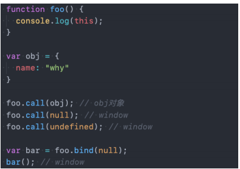
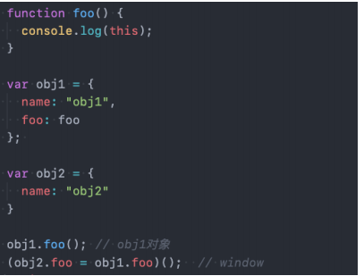
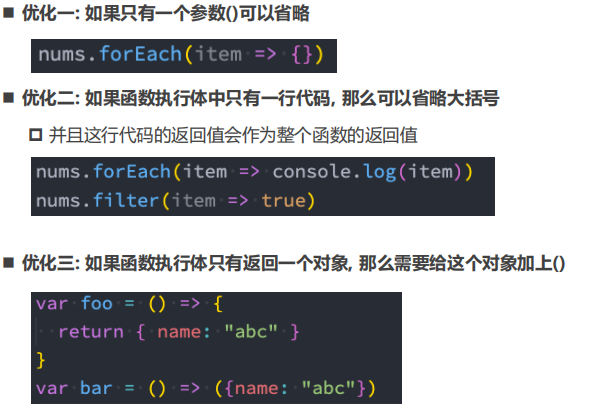

## 1. new 绑定

 使用`new`关键字来调用函数是，会执行如下的操作：

1. 创建一个全新的对象；
2. 这个新对象会被执行`prototype`连接；
3. 这个新对象会绑定到函数调用的`this`上（`this`的绑定在这个步骤完成）；
4. 如果函数没有返回其他对象，表达式会返回这个新对象；


## 2. 规则优先级

◼ **1.默认规则的优先级最低**

*  毫无疑问，默认规则的优先级是最低的，因为存在其他规则时，就会通过其他规则的方式来绑定`this`


◼ **2.显示绑定优先级高于隐式绑定**


◼ **3.**`**new**`**绑定优先级高于隐式绑定**


◼ **4.**`**new**`**绑定优先级高于**`**bind**`

*  `new`绑定和`call`、`apply`是不允许同时使用的，所以不存在谁的优先级更高

*  `new`绑定可以和`bind`一起使用，new绑定优先级更高


## 3. 忽略显示绑定

如果在显示绑定中，我们传入一个`null`或者`undefined`，那么这个显示绑定会被忽略，使用默认规则：



## 4. 间接函数引用

创建一个函数的间接引用，这种情况使用默认绑定规则。

-  赋值(`obj2.foo = obj1.foo`)的结果是`foo`函数；

-  `foo`函数被直接调用，那么是默认绑定；




## 5. 箭头函数

**箭头函数有以下特性**

- 箭头函数不会创建自己的`this`绑定。它们会从定义时的上下文中捕获`this`的值。这使得箭头函数在事件处理程序、回调函数等场景中非常方便。
- 箭头函数不能作为构造函数使用。因此，不能使用`new`关键字来调用箭头函数。
- 箭头函数没有`arguments`对象。如果需要使用类似`arguments`的功能，可以使用ES6中的剩余参数（Rest Parameters (参数) ）语法。
- 箭头函数没有`prototype`属性。因为它们不能作为构造函数使用，所以也不需要`prototype`属性。


## 6. 编写优化




箭头函数不使用`this`的四种标准规则（也就是不绑定`this`），而是根据外层作用域来决定`this`

## 7. 关于this的几个面试题

注释即为 this 的指向

箭头函数无 this !!!

```javascript
var name = "window";

var person = {
  name: "person",
  sayName: function () {
    console.log(this.name);
  }
};

function sayName() {
  var sss = person.sayName;

  sss(); // 绑定: 默认绑定, window -> window
  // node.js 运行出来是undefine

  person.sayName(); // 绑定: 隐式绑定, person -> person

  (person.sayName)(); // 绑定: 隐式绑定, person -> person

  (b = person.sayName)(); // 术语: 间接函数引用, window -> window  
  // node.js 运行出来是undefine
}

sayName();
```

------

```javascript
var name = 'window'
 
 
// {} -> 对象
// {} -> 代码块
var person1 = {
  name: 'person1',
  foo1: function () {
    console.log(this.name)
  },
  foo2: () => console.log(this.name),
  foo3: function () {
    return function () {
      console.log(this.name)
    }
  },
  foo4: function () {
    // console.log(this) // 第一个表达式this -> person1
    // console.log(this) // 第二个表达式this -> person2
    // console.log(this) // 第三个表达式this -> person1
     
    return () => {
      console.log(this.name)
    }
  }
}
 
var person2 = { name: 'person2' }
 
 
// 开始题目:
person1.foo1(); // 隐式绑定: person1
person1.foo1.call(person2); // 显式绑定: person2
 
person1.foo2(); // 上层作用域: window
person1.foo2.call(person2); // 上层作用域: window
 
person1.foo3()(); // 默认绑定: window
person1.foo3.call(person2)(); // 默认绑定: window
person1.foo3().call(person2); // 显式绑定: person2
 
person1.foo4()(); // person1
person1.foo4.call(person2)(); // person2
person1.foo4().call(person2); // person1
```


```javascript
var name = 'window'
 
/*
  1.创建一个空的对象
  2.将这个空的对象赋值给this
  3.执行函数体中代码
  4.将这个新的对象默认返回
*/
function Person(name) {
  this.name = name
  this.foo1 = function () {
    console.log(this.name)
  },
  this.foo2 = () => console.log(this.name),
  this.foo3 = function () {
    return function () {
      console.log(this.name)
    }
  },
  this.foo4 = function () {
    return () => {
      console.log(this.name)
    }
  }
}
 
// person1/person都是对象(实例instance)
var person1 = new Person('person1')
var person2 = new Person('person2')
 
 
// 面试题目:
person1.foo1() // 隐式绑定: person1
person1.foo1.call(person2) // 显式绑定: person2
 
person1.foo2() // 上层作用域查找: person1
person1.foo2.call(person2) // 上层作用域查找: person1
 
person1.foo3()() // 默认绑定: window
person1.foo3.call(person2)() // 默认绑定: window
person1.foo3().call(person2) // 显式绑定: person2
 
person1.foo4()() // 上层作用域查找: person1(隐式绑定)
person1.foo4.call(person2)() //  上层作用域查找: person2(显式绑定)
person1.foo4().call(person2) // 上层作用域查找: person1(隐式绑定)
```


```javascript
var name = 'window'
 
/*
  1.创建一个空的对象
  2.将这个空的对象赋值给this
  3.执行函数体中代码
  4.将这个新的对象默认返回
*/
function Person(name) {
  this.name = name
  this.obj = {
    name: 'obj',
    foo1: function () {
      return function () {
        console.log(this.name)
      }
    },
    foo2: function () {
      return () => {
        console.log(this.name)
      }
    }
  }
}
 
var person1 = new Person('person1')
var person2 = new Person('person2')
 
person1.obj.foo1()() // 默认绑定: window
person1.obj.foo1.call(person2)() // 默认绑定: window
person1.obj.foo1().call(person2) // 显式绑定: person2
 
person1.obj.foo2()() // 上层作用域查找: obj(隐式绑定)
person1.obj.foo2.call(person2)() // 上层作用域查找: person2(显式绑定)
person1.obj.foo2().call(person2) // 上层作用域查找: obj(隐式绑定)
```