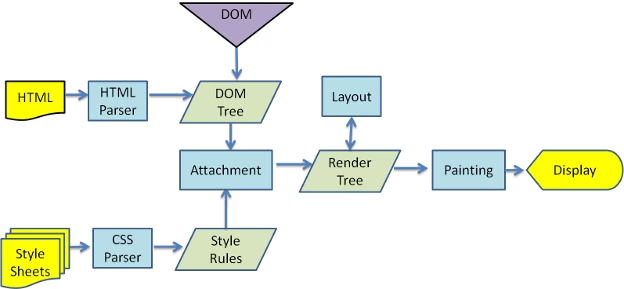
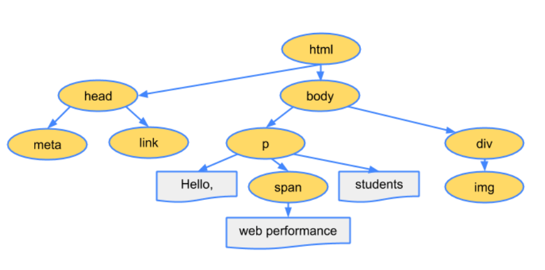
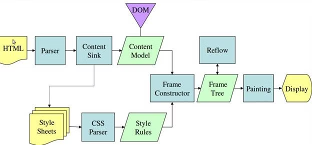
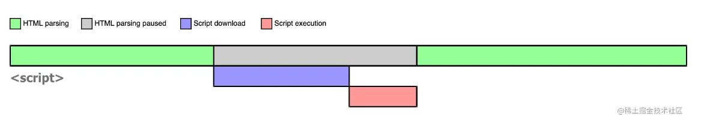
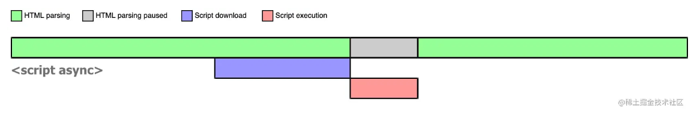
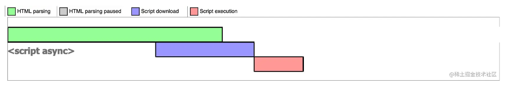
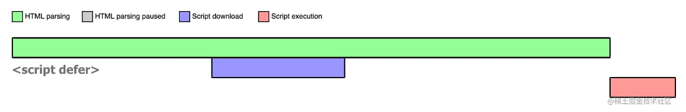

## 1. 网页的解析过程


渲染页面的详细流程




### 1.1. html 解析过程

◼ 因为默认情况下服务器会给浏览器返回`index.html`文件，所以解析`HTML`是所有步骤的开始：

◼ 解析`HTML`，会构建`DOM Tree`：





### 1.2. 生成 css 规则

◼ 在解析的过程中，如果遇到`CSS`的`link`元素，那么会由浏览器负责下载对应的`CSS`文件：

 注意：下载 `CSS` 文件是不会影响`DOM`的解析的；

◼ 浏览器下载完 `CSS` 文件后，就会对`CSS`文件进行解析，解析出对应的规则树：

 我们可以称之为 `CSSOM`（`CSS Object Model`，`CSS`对象模型）


### 1.3. 构建`Render Tree`

当有了`DOM Tree`和 `CSSOM Tree`后，就可以两个结合来构建`Render Tree`了

◼ 注意一：`link`元素不会阻塞`DOM Tree`的构建过程，但是会阻塞`Render Tree`的构建过程

 这是因为`Render Tree`在构建时，需要对应的`CSSOM Tree`；

◼ 注意二：`Render Tree`和`DOM Tree`并不是 一 一 对应的关系，

比如对于`display`为`none`的元素，压根不会出现在`render tree`中；


### 1.4. 布局（`layout`）和绘制（`Paint`）


◼ 第四步是在渲染树（`Render Tree`）上运行布局（`Layout`）以计算每个节点的几何体。

 渲染树(`Render Tree`)会表示显示哪些节点以及其他样式，但是不表示每个节点的尺寸、位置等信息；

 布局(`layout`)是确定呈现树中所有节点的宽度、高度和位置信息；

◼ 第五步是将每个节点绘制（`Paint`）到屏幕上

 在绘制阶段，浏览器将布局阶段计算的每个`frame`转为屏幕上实际的像素点；

 包括将元素的可见部分进行绘制，比如文本、颜色、边框、阴影、替换元素（比如img）





## 2. 回流和重绘


### 2.1. 理解回流和重绘


◼ 理解回流 `reflow`：（也可以称之为重排）

 第一次确定节点的大小和位置，称之为布局（`layout`）。

 之后对节点的大小、位置修改重新计算称之为回流。

◼ 什么情况下引起回流呢？

 比如DOM结构发生改变（添加新的节点或者移除节点）；

 比如改变了布局（修改了`width`、`height`、`padding`、`font-size`等值）

 比如窗口`resize`（修改了窗口的尺寸等）

 比如调用`getComputedStyle`方法获取尺寸、位置信息；

◼ 理解重绘 `repaint`：

 第一次渲染内容称之为绘制（`paint`）。

 之后重新渲染称之为重绘。

◼ 什么情况下会引起重绘呢？

 比如修改背景色、文字颜色、边框颜色、样式等；


回流一定会引起重绘, 所以回流是一件很消耗性能的事情。所以在开发中要尽量避免发生回流


### 2.2. 避免发生回流的做法


- 修改样式时尽量一次性修改

- -  比如通过`cssText`修改，比如通过添加`class`修改


- 尽量避免频繁的操作`DOM`

- - 我们可以在一个`DocumentFragment`或者父元素中将要操作的`DOM`操作完成，再一次性的操作；


- 尽量避免通过`getComputedStyle`获取尺寸、位置等信息；


- 对某些元素使用`position`的`absolute`或者`fixed`

- -  并不是不会引起回流，而是开销相对较小，不会对其他元素造成影响


### 2.3. composite合成

◼ 绘制的过程，可以将布局后的元素绘制到多个合成图层中。

 这是浏览器的一种优化手段；

◼ 默认情况下，标准流中的内容都是被绘制在同一个图层（`Layer`）中的； (`absolute`定位也是)

◼ 而一些特殊的属性，会创建一个新的合成层（ `CompositingLayer` ），并且新的图层可以利用`GPU`来加速绘制；

 因为每个合成层都是单独渲染的；

◼ 那么哪些属性可以形成新的合成层呢？常见的一些属性：

 `3D transforms`

 `video、canvas、iframe`

 `opacity` 动画转换时；

 `position: fixed`

 `will-change`：一个实验性的属性，提前告诉浏览器元素可能发生哪些变化；

 `animation` 或 `transition` 设置了`opacity`、`transform`；

◼ 分层确实可以提高性能，但是它 以内存管理为代价，因此不应作为 `web` 性能优化策略的一部分过度使用

## 3. script元素和页面解析的关系

**◼ 我们现在已经知道了页面的渲染过程，但是JavaScript在哪里呢？**

 事实上，浏览器在解析HTML的过程中，遇到了`script`元素是不能继续构建`DOM`树的；

 它会停止继续构建，首先下载`JavaScript`代码，并且执行`JavaScript`的脚本；

 只有等到`JavaScript`脚本执行结束后，才会继续解析`HTML`，构建`DOM`树；

**◼ 为什么要这样做呢？**

-  这是因为`JavaScript`的作用之一就是操作`DOM`，并且可以修改`DOM`；
- 如果我们等到`DOM`树构建完成并且渲染再执行`JavaScript`，会造成严重的回流和重绘，影响页面的性能；
- 所以会在遇到`script`元素时，优先下载和执行`JavaScript`代码，再继续构建`DOM`树；

◼ **但是这个也往往会带来新的问题，特别是现代页面开发中：**

- 在目前的开发模式中（比如`Vue`、`React`），脚本往往比HTML页面更“重”，处理时间需要更长；
- 所以会造成页面的解析阻塞，在脚本下载、执行完成之前，用户在界面上什么都看不到；

**◼ 为了解决这个问题，**`**script**`**元素给我们提供了两个属性（attribute）：**`**defer**`**和**`**async**`


### 3.1. defer 和 async


◼ defer 属性告诉浏览器不要等待脚本下载，而继续解析`HTML`，构建`DOM Tree`。

-  脚本会由浏览器来进行下载，但是不会阻塞`DOM Tree`的构建过程；
-  如果脚本提前下载好了，**它会等待**`**DOM Tree**`**构建完成，在**`**DOMContentLoaded**`**事件之前先执行**`**defer**`**中的代码**；

◼ 所以`DOMContentLoaded`总是会等待`defer`中的代码先执行完成。

◼ 另外多个带`defer`的脚本是可以保持正确的顺序执行的。

◼ 从某种角度来说，`defer`可以提高页面的性能，并且推荐放到`head`元素中；

◼ 注意：`defer`仅适用于外部脚本，对于`script`默认内容会被忽略。

------

◼ `async` 特性与 `defer` 有些类似，它也能够让脚本不阻塞页面。

◼ `async`是让一个脚本完全独立的：

 浏览器不会因 `async` 脚本而阻塞（与 `defer` 类似）；

 `async`脚本不能保证顺序，它是独立下载、独立运行，不会等待其他脚本；

 `async`不会能保证在`DOMContentLoaded`之前或者之后执行；

◼ `defer`通常用于需要在文档解析后操作`DOM`的`JavaScript`代码，并且对多个`script`文件有顺序要求的；

◼ `async`通常用于独立的脚本，对其他脚本，甚至`DOM`没有依赖的；

**注意**：`async`和`defer`属性只适用于外部脚本，即使用`src`属性引入的脚本。它们不适用于内联脚本，即在`HTML`文档中使用<`script`>标签定义的脚本。


### 3.2. 他们之间的区别

**区别**

`async`属性和`defer`属性的主要区别在于脚本执行的时间。

`async`属性会在脚本加载完成后立即执行脚本，而`defer`属性会在页面解析完成后按照它们在页面中出现的顺序依次执行脚本。另外，`async`属性的脚本执行顺序是不确定的，而`defer`属性的脚本执行顺序是按照它们在页面中出现的顺序依次执行的。


### 3.3. 图解 🔥

**普通**`**script**`




------

------


```
**async script**
```



如果在 JS 脚本请求回来之前，HTML 已经解析完毕了，那就啥事没有，立即执行 JS 代码




------

------


```
**defer script**
```

