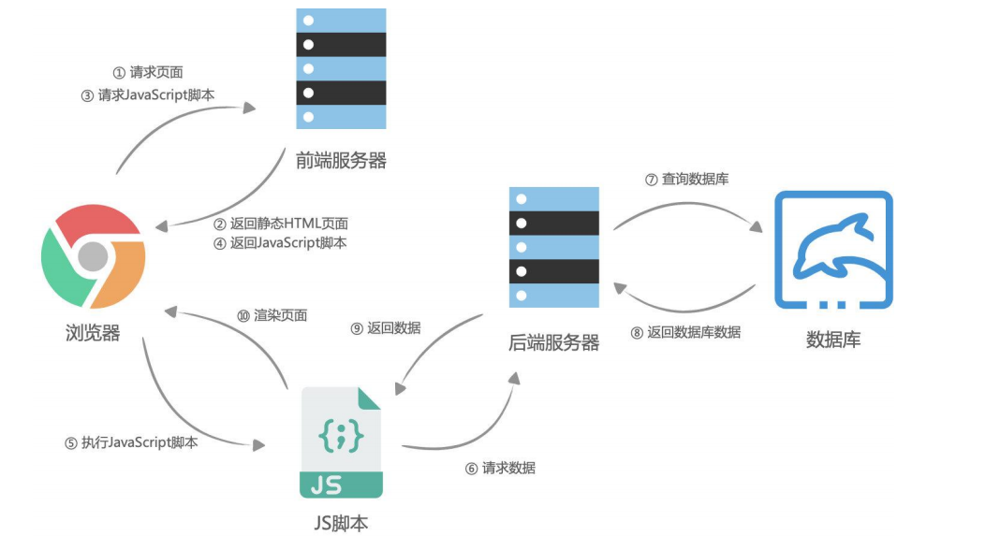

## 1. 前端数据请求方式


### 1.1. 前后端分离的优势


早期的网页都是通过后端渲染来完成的：服务器端渲染（`SSR`，server side render）

服务器端渲染的缺点：

- 当用户点击页面中的某个按钮向服务器发送请求时，页面本质上只是一些数据发生了变化，而此时服务器却要将重绘的整个页面再返回给浏览器加载，这显然有悖于程序员的“`DRY`（ Don‘t repeat yourself ）”原则；
-  而且明明只是一些数据的变化却迫使服务器要返回整个`HTML`文档，这本身也会给网络带宽带来不必要的开销。

有没有办法在页面数据变动时，只向服务器请求新的数据，并且在阻止页面刷新的情况下，动态的替换页面中展示的数据呢？

- 答案正是“`AJAX`”。

AJAX是“Asynchronous JavaScript And XML”的缩写(异步的JavaScript和XML)，是一种实现 无页面刷新 获取服务器数据的技术。

AJAX最吸引人的就是它的“异步”特性，也就是说它可以在不重新刷新页面的情况下与服务器通信，交换数据，或更新页面. 

 你可以使用AJAX最主要的两个特性做下列事：

- 在不重新加载页面的情况下发送请求给服务器；
-  接受并使用从服务器发来的数据。


### 1.2. 网页的渲染过程 -- 服务器端渲染


### 1.3. 网页的渲染过程 -- 前后端分离




## 2. HTTP

### 2.1. HTTP 的版本

- HTTP/0.9 

- - 发布于1991年；
  - 只支持GET请求方法获取文本数据，当时主要是为了获取HTML页面内容；

- ◼ HTTP/1.0 

- - 发布于1996年；
  - 支持POST、HEAD等请求方法，支持请求头、响应头等，支持更多种数据类型(不再局限于文本数据) ；
  - 但是浏览器的每次请求都需要与服务器建立一个TCP连接，请求处理完成后立即断开TCP连接，每次建立连接增加了性能损耗；

- HTTP/1.1(目前使用最广泛的版本) 🔥

- - 发布于1997年；
  - 增加了PUT、DELETE等请求方法；
  - 采用持久连接(Connection: keep-alive)，多个请求可以共用同一个TCP连接；

- 2015年，HTTP/2.0
- 2018年，HTTP/3.0


### 2.2. HTTP 的请求方式


### 2.3. HTTP Request Header (请求头)


◼ `**content-type**`**是这次请求携带的数据的类型：🔥**

-  `application/x-www-form-urlencoded`：表示数据被编码成以 '&' 分隔的键 - 值对，同时以 '=' 分隔键和值 
-  `application/json`：表示是一个json类型； 
-  `text/plain`：表示是文本类型；
-  `application/xml`：表示是xml类型；
-  `multipart/form-data`：表示是上传文件；

◼ `content-length`：文件的大小长度

◼ `keep-alive`：

-  `http`是基于`TCP`协议的，但是通常在进行一次请求和响应结束后会立刻中断；
-  在`http1.0`中，如果想要继续保持连接：

- -  浏览器需要在请求头中添加 `connection: keep-alive`；
  - 服务器需要在响应头中添加 `connection:keey-alive`；
  - 当客户端再次放请求时，就会使用同一个连接，直接一方中断连接；

-  在`http1.1`中，所有连接默认是 `connection: keep-alive`的；

- - 不同的`Web`服务器会有不同的保持 `keep-alive`的时间；
  - `Node`中默认是`5s`；

◼ `accept-encoding`：告知服务器，客户端支持的文件压缩格式，比如`js`文件可以使用`gzip`编码，对应 `.gz`文件；

◼ `accept`：告知服务器，客户端可接受文件的格式类型；

◼ `user-agent`：客户端相关的信息；

### 2.4. HTTP Response响应状态码

Http状态码（Http Status Code）是用来表示`Http`响应状态的数字代码：

- `Http`状态码非常多，可以根据不同的情况，给客户端返回不同的状态码；
- MDN响应码解析地址：[链接](https://developer.mozilla.org/zh-CN/docs/web/http/status)


## 3. AJAX发送请求

### 3.1.  `XHR`请求的基本使用

- `AJAX` 是异步的 `JavaScript` 和 `XML`（Asynchronous JavaScript And XML）

- - 它可以使用 `JSON`，`XML`，`HTML` 和 `text` 文本等格式发送和接收数据；

- 如何来完成`AJAX`请求呢？

- - 第一步：创建网络请求的`AJAX`对象（使用`XMLHttpRequest`）
  - 第二步：监听`XMLHttpRequest`对象状态的变化，或者监听`onload`事件（请求完成时触发）；
  - 第三步：配置网络请求（通过`open`方法）；
  - 第四步：发送`send`网络请求；

```javascript
// 1.创建XMLHttpRequest对象
const xhr = new XMLHttpRequest()

// 2.监听状态的改变(宏任务)
xhr.onreadystatechange = function() {
    // console.log(xhr.response)
    if (xhr.readyState !== XMLHttpRequest.DONE) return

    // 将字符串转成JSON对象(js对象)
    const resJSON = JSON.parse(xhr.response)
    const banners = resJSON.data.banner.list
    console.log(banners)
}

// 3.配置请求open
// method: 请求的方式(get/post/delete/put/patch...)
// url: 请求的地址
xhr.open("get", "http://123.207.32.32:8000/home/multidata")

// 4.发送请求(浏览器帮助发送对应请求)
xhr.send()
```


### 3.2. XHR-XHR状态变化的监听

事实上，我们在一次网络请求中看到状态 (`readyState`) 发生了很多次变化，这是因为对于一次请求来说包括如下的状态：


注意：这个状态并非是`HTTP`的相应状态，而是记录的`XMLHttpRequest`对象的状态变化。

`http`响应状态通过`status`获取；


这里其实 `onload` 更方便

```javascript
// 1.创建XMLHttpRequest对象
const xhr = new XMLHttpRequest()

// 2.监听状态的改变(宏任务)
// 监听四种状态
xhr.onreadystatechange = function() {
    // 1.如果状态不是DONE状态, 直接返回
    if (xhr.readyState !== XMLHttpRequest.DONE) return
    // 或者 if (xhr.readyState !== 4) return

    // 2.确定拿到了数据
    console.log(xhr.response)
}

// 3.配置请求open	
xhr.open("get", "http://123.207.32.32:8000/home/multidata")

// 4.发送请求(浏览器帮助发送对应请求)
xhr.send()
```


### 3.3. XHR-XHR发送同步的请求

默认为异步请求, `open` 的第三个参数设置为`false`即为取消异步 , 默认为`true`即为异步

```javascript
const xhr = new XMLHttpRequest()

xhr.open("get", "http://123.207.32.32:8000/home/multidata", false)

// 发送请求(浏览器帮助发送对应请求)
xhr.send()

// 同步必须等到有结果后, 才会继续执行
console.log(xhr.response)

console.log("------")
console.log("++++++")
console.log("******")
```


如果是异步的话, 必须监听状态的改变 -- 

```javascript
    // 1.创建XMLHttpRequest对象
    const xhr = new XMLHttpRequest()

    // 2.监听状态的改变(宏任务)
    // 监听四种状态
    xhr.onreadystatechange = function() {
    //   // 1.如果状态不是DONE状态, 直接返回
      if (xhr.readyState !== XMLHttpRequest.DONE) return

    //   // 2.确定拿到了数据
      console.log(xhr.response)
    }

    // 3.配置请求open
    // async: false
    // 实际开发中要使用异步请求, 异步请求不会阻塞js代码继续执行
    xhr.open("get", "http://123.207.32.32:8000/home/multidata")

    // 4.发送请求(浏览器帮助发送对应请求)
    xhr.send()

    // 5.同步必须等到有结果后, 才会继续执行
    console.log(xhr.response)

    console.log("------")
    console.log("++++++")
    console.log("******")
```


### 3.4. XHR-XHR其他事件的监听

◼ 除了`onreadystatechange`还有其他的事件可以监听

- `loadstart`：请求开始。
- `progress`： 一个响应数据包到达，此时整个 response body 都在 response 中。
- `abort`：调用 xhr.abort() 取消了请求。
- `error`：发生连接错误，例如，域错误。不会发生诸如 404 这类的 HTTP 错误。
- `load`：请求成功完成。
- `timeout`：由于请求超时而取消了该请求（仅发生在设置了 timeout 的情况下）。
- `loadend`：在 load，error，timeout 或 abort 之后触发

```javascript
const xhr = new XMLHttpRequest()
// onload监听数据加载完成
xhr.onload = function() {
  console.log("onload")
}
xhr.open("get", "http://123.207.32.32:8000/home/multidata")
xhr.send()
```


### 3.5. XHR-XHR响应数据和类型

发送了请求后，我们需要获取对应的结果：`response`属性

- `XMLHttpRequest response` 属性返回响应的正文内容；
- 返回的类型取决于`responseType`的属性设置
- 如果将 `responseType` 的值设置为空字符串，则会使用 `text` 作为默认值

```javascript
// 1.创建XMLHttpRequest对象
const xhr = new XMLHttpRequest()

// 2.onload监听数据加载完成
xhr.onload = function() {
  // const resJSON = JSON.parse(xhr.response)
  console.log(xhr.response)
  // console.log(xhr.responseText)
  // console.log(xhr.responseXML)
}

// 3.告知xhr获取到的数据的类型
xhr.responseType = "json"
// xhr.responseType = "xml"

// 4.配置网络请求
// 4.1.json类型的接口
xhr.open("get", "http://123.207.32.32:8000/home/multidata")
// 4.2.json类型的接口
// xhr.open("get", "http://123.207.32.32:1888/01_basic/hello_json")
// 4.3.text类型的接口
// xhr.open("get", "http://123.207.32.32:1888/01_basic/hello_text")
// 4.4.xml类型的接口
// xhr.open("get", "http://123.207.32.32:1888/01_basic/hello_xml")

// 5.发送网络请求
xhr.send()
```


### 3.6. XHR-获取HTTP的状态码

```
xhr.status`  /  `xhr.statusText
```

◼ `XMLHttpRequest`的`state`是用于记录`xhr`对象本身的状态变化，并非针对于`HTTP`的网络请求状态。

◼ 如果我们希望获取`HTTP`响应的网络状态，可以通过`status`和`statusText`来获取


```javascript
// 1.创建对象
const xhr = new XMLHttpRequest()

// 2.监听结果
xhr.onload = function() {
  console.log(xhr.status, xhr.statusText)
  // 根据http的状态码判断是否请求成功
  if (xhr.status >= 200 && xhr.status < 300) {
    console.log(xhr.response)
  } else {
    console.log(xhr.status, xhr.statusText)  
  }
}

xhr.onerror = function() {
  console.log("onerror", xhr.status, xhr.statusText)
}

// 3.设置响应类型
xhr.responseType = "json"

// 4.配置网络请求
// xhr.open("get", "http://123.207.32.32:8000/abc/cba/aaa")
xhr.open("get", "http://123.207.32.32:8000/home/multidata")

// 5.发送网络请求
xhr.send()
```


### 3.7. XHR-GET-POST请求传参

背景代码


常见的传递给服务器数据的方式有如下几种：

1. `GET`请求的`query`参数
2. `POST`请求 `x-www-form-urlencoded` 格式
3. `POST`请求 `FormData` 格式
4. `POST`请求 `JSON` 格式

#### 3.7.1. 传递参数方式一 :  get -> query

```javascript
xhr.open("get", "http://123.207.32.32:1888/02_param/get?name=why&age=18&address=广州市")
xhr.send()
```


#### 3.7.2. 传递参数方式二  : post -> urlencoded

```javascript
xhr.open("post", "http://123.207.32.32:1888/02_param/posturl")
// 发送请求(请求体body)
xhr.setRequestHeader("Content-type", "application/x-www-form-urlencoded")
xhr.send("name=why&age=18&address=广州市")
```


#### 3.7.3. 传递参数方式三 : post -> formdata

```javascript
xhr.open("post", "http://123.207.32.32:1888/02_param/postform")
// formElement对象转成FormData对象
const formData = new FormData(formEl)
xhr.send(formData)
```


#### 3.7.4. 传递参数方式四: post -> json

```javascript
xhr.open("post", "http://123.207.32.32:1888/02_param/postjson")
xhr.setRequestHeader("Content-type", "application/json")
xhr.send(JSON.stringify({name: "why", age: 18, height: 1.88}))
```


### 3.8. XHR-Ajax网络请求封装

```javascript
    // 练习hyajax -> axios
    function hyajax({
      url,
      method = "get",
      data = {},
      headers = {}, // token
      success,
      failure
    } = {}) {
      // 1.创建对象
      const xhr = new XMLHttpRequest()

      // 2.监听数据
      xhr.onload = function() {
        if (xhr.status >= 200 && xhr.status < 300) {
          success && success(xhr.response)
        } else {
          failure && failure({ status: xhr.status, message: xhr.statusText })
        }
      }

      // 3.设置类型
      xhr.responseType = "json"

      // 4.open方法
      if (method.toUpperCase() === "GET") {
        const queryStrings = []
        for (const key in data) {  // 如果说将参数写进 data 里面, 则需要拼接到url中
          queryStrings.push(`${key}=${data[key]}`)
        }
        url = url + "?" + queryStrings.join("&")
        xhr.open(method, url)
        xhr.send()
      } else {   // 为 post 请求
        xhr.open(method, url)
        xhr.setRequestHeader("Content-type", "application/json")
        xhr.send(JSON.stringify(data))
      }

      return xhr
    }
```


调用 get 请求

```javascript
    hyajax({
      url: "http://123.207.32.32:1888/02_param/get",
      method: "GET",
      data: {
        name: "why",
        age: 18
      },
      success: function(res) {
        console.log("res:", res)
      },
      failure: function(err) {
        alert(err.message)
      }
    })
```


调用 post 请求

```javascript
    hyajax({
      url: "http://123.207.32.32:1888/02_param/postjson",
      method: "post",
      data: {
        name: "jsondata",
        age: 22
      },
      success: function(res) {
        console.log("res:", res)
      },
      failure: function(err) {
        alert(err.message)
      }
    })
```


### 3.9. XHR-Ajax网络请求工具 (封装)

利用 `promise`

```javascript
// 练习hyajax -> axios
function hyajax({
  url,
  method = "get",
  data = {},
  timeout = 10000,
  headers = {}, // token
} = {}) {
  // 1.创建对象
  const xhr = new XMLHttpRequest()

  // 2.创建Promise
  const promise = new Promise((resolve, reject) => {

    // 2.监听数据
    xhr.onload = function() {
      if (xhr.status >= 200 && xhr.status < 300) {
        resolve(xhr.response)
      } else {
        reject({ status: xhr.status, message: xhr.statusText })
      }
    }

    // 3.设置类型
    xhr.responseType = "json"
    xhr.timeout = timeout

    // 4.open方法
    if (method.toUpperCase() === "GET") {
      const queryStrings = []
      for (const key in data) {
        queryStrings.push(`${key}=${data[key]}`)
      }
      url = url + "?" + queryStrings.join("&")
      xhr.open(method, url)
      xhr.send()
    } else {
      xhr.open(method, url)
      xhr.setRequestHeader("Content-type", "application/json")
      xhr.send(JSON.stringify(data))
    }
  })

  promise.xhr = xhr

  return promise
}
```


调用

```javascript
    const promise = hyajax({
      url: "http://123.207.32.32:1888/02_param/get",
      data: {
        username: "coderwhy",
        password: "123456"
      }
    })

    promise.then(res => {
      console.log("res:", res)
    }).catch(err => {
      console.log("err:", err)
    })
```


### 3.10. XHR-取消请求-超时时间

◼ 在网络请求的过程中，为了避免过长的时间服务器无法返回数据，通常我们会为请求设置一个超时时间：`timeout`。

 当达到超时时间后依然没有获取到数据，那么这个请求会自动被取消掉；

 默认值为`0，`表示没有设置超时时间；

◼ 我们也可以通过`abort`方法强制取消请求；

取消请求利用 `xhr.abort()` 方法 

这里服务器 收到请求的时间 设置的是 6s

如果在中途取消请求, 则触发 第7行

```javascript
    const xhr = new XMLHttpRequest()

    xhr.onload = function() {
      console.log(xhr.response)
    }
    xhr.onabort = function() {
      console.log("请求被取消掉了")
    }
    
    xhr.responseType = "json"

    xhr.open("get", "http://123.207.32.32:1888/01_basic/timeout")

    xhr.send()

    // 手动取消结果
    const cancelBtn = document.querySelector("button")
    cancelBtn.onclick = function() {
      xhr.abort()
    }
```


超时时间的设置

`timeout`: 浏览器达到过期时间还没有获取到对应的结果时, 取消本次请求

这里 3 < 6 所以取消请求

```javascript
    // 超时时间的设置
    xhr.ontimeout = function() {
      console.log("请求过期: timeout")
    }

    // timeout: 浏览器达到过期时间还没有获取到对应的结果时, 取消本次请求
    xhr.timeout = 3000
```


## 4. Fetch-Fetch函数基本使用

`Fetch`可以看做是早期的`XMLHttpRequest`的替代方案，它提供了一种更加现代的处理方案：

- 比如返回值是一个`Promise`，提供了一种更加优雅的处理结果方式

- - 在请求发送成功时，调用`resolve`回调`then`
  - 在请求发送失败时，调用`reject`回调`catch`

- 比如不像`XMLHttpRequest`一样，所有的操作都在一个对象上；


为了获取 `response body`，我们需要使用一个其他的方法调用。

```javascript
response.text() // 读取 response，并以文本形式返回 response；
response.json() // 将 response 解析为 JSON；
```


### 4.1. fetch发送get请求

#### 4.1.1. 未优化的代码

```javascript
fetch("http://123.207.32.32:8000/home/multidata").then(res => {
  // 1.获取到response
  const response = res

  // 2.获取具体的结果
  response.json().then(res => {
    console.log("res:", res)
  })
}).catch(err => {
  console.log("err:", err)
})
```

#### 4.1.2. 优化方式一

避免回调地狱

```javascript
    fetch("http://123.207.32.32:8000/home/multidata").then(res => {
      // 1.获取到response
      const response = res
      // 2.获取具体的结果
      return response.json()
    }).then(res => {
      console.log("res:", res)
    }).catch(err => {
      console.log("err:", err)
    })
```

#### 4.1.3. 优化方式二

async -- await 处理异步函数 🔥

```javascript
async function getData() {
      const response = await fetch("http://123.207.32.32:8000/home/multidata")
      const res = await response.json()
      console.log("res:", res)
    }
    getData()
```


### 4.2. 发送post请求并且有参数

- `method`：`HTTP` 方法，例如 `POST`，
- `body`：`request body，`其中之一：

- -  字符串（例如 `JSON` 编码的），
  - `FormData` 对象，以 `multipart/form-data` 形式发送数据

#### 4.2.1. json格式

```javascript
    async function getData() {
      const response = await fetch("http://123.207.32.32:1888/02_param/postjson", {
        method: "post",
        // headers: {
        //   "Content-type": "application/json"
        // },
        body: JSON.stringify({
          name: "why",
          age: 18
        })
      })
       // 获取response状态
      console.log(response.ok, response.status, response.statusText)

      const res = await response.json()
      console.log("res:", res)
    }
    getData()
```


#### 4.2.2. FromData格式

```javascript
async function getData() {

  const formData = new FormData()
  formData.append("name", "why")
  formData.append("age", 18)
  const response = await fetch("http://123.207.32.32:1888/02_param/postform", {
    method: "post",
    body: formData
  })

  // 获取response状态
  console.log(response.ok, response.status, response.statusText)

  const res = await response.json()
  console.log("res:", res)
}
getData()
```


## 5. 文件上传 (了解)

要想真正理解文件上传，必须了解服务器如何处理上传的文件信息；

### 5.1. XHR-文件上传的接口演练

html

```html
<input class="file" type="file">
<button class="upload">上传文件</button>
```


js

```javascript
const uploadBtn = document.querySelector(".upload")
uploadBtn.onclick = function() {
  // 1.创建对象
  const xhr = new XMLHttpRequest()

  // 2.监听结果
  xhr.onload = function() {
    console.log(xhr.response)
  }

  xhr.onprogress = function(event) {
    console.log(event)
  }


  xhr.responseType = "json"
  xhr.open("post", "http://123.207.32.32:1888/02_param/upload")

  // 表单
  const fileEl = document.querySelector(".file")
  const file = fileEl.files[0]

  const formData = new FormData()
  formData.append("avatar", file)

  xhr.send(formData)
}
```


### 5.2. Fetch-文件上传的接口演练

`Fetch`也支持文件上传，但是`Fetch`没办法监听进度。

html

```html
<input class="file" type="file">
<button class="upload">上传文件</button>v
```


js

```javascript
const uploadBtn = document.querySelector(".upload")
uploadBtn.onclick = async function() {
  // 表单
  const fileEl = document.querySelector(".file")
  const file = fileEl.files[0]

  const formData = new FormData()
  formData.append("avatar", file)

  // 发送fetch请求
  const response = await fetch("http://123.207.32.32:1888/02_param/upload", {
    method: "post",
    body: formData
  })
  const res = await response.json()
  console.log("res:", res)
}
```