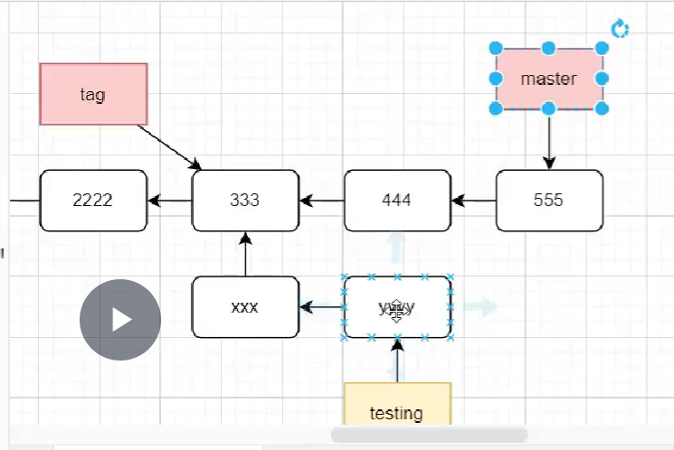

##  webpack

打包 -> 普通代码 -> 部署到静态服务器

如何打包?

> 打包工具  (都是一些js代码程序   文件操作)
>
> 运行的环境  node

* gulp
* rollup
* webpack (最强) 
* vite 🔥

直接拿来用可以 

自己修改东西就要学习

path.resolve

webpack  webpack-cli

为了在命令行使用要安装 webpack-cli

## git

### git cat-file -t 00d2

`git cat-file -t 00d2` 查看 `.git/objects/00/d2...`这个文件

会返回 blob , 代表这是一个二进制文件

`git cat-file -p 00d2`就会返回这个二进制文件具体的内容

当你用`git commit -m ""`提交到本地仓库后

仓库中会多出两个文件 一个

再次使用`git cat-file -p `

### git master分支

并非一个特殊分支

## git本地创建仓库常规操作

> 这个方案很麻烦

1. git init

2. 修改代码 or 其它

3. git add .

4. git commit -m ""

5. git remote add origin <name>

6. git fetch

7. git branch --set-upstream-to=origin/main

8. git merge --allow-unrelated-histories

9. git config push.default upstream

10. git push

    
